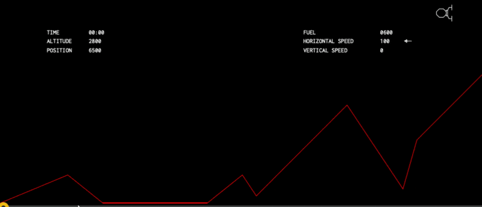

# Landolás a Marson



A ["Formáld a világod!"](https://verseny.c3.hu/) 2026 verseny kapcsán az egyik workshop interaktív anyagrésze.  

A CodinGame.com-on megtalálható Mars Lander 1 és Mars Lander 2 programozós fejtőrőket mutatja be ez a projekt.  
- https://www.codingame.com/ide/puzzle/mars-lander-episode-1
- https://www.codingame.com/ide/puzzle/mars-lander-episode-2

## Tartalom

[Jupyter notebook ismerkedés](notebooks/START.ipynb)  
[Mars Landolás könnyű pálya](notebooks/Mars_1.ipynb)  
[Mars Landolás haladó pálya](notebooks/Mars_2.ipynb)  

## Megoldások

[Könnyű pálya](mars-lander-1/megoldas.py)  
[Könnyű pálya, üzemanyagkímélő](mars-lander-1/nehez_megoldas.py)  
[Haladó pálya](mars-lander-2/megoldas.py)

## Hogyan tudom kipróbálni, futtatni?

A mars landolós kódokat a codingame.com futtatja.  
Könnyű pálya: https://www.codingame.com/ide/puzzle/mars-lander-episode-1  
Haladó pálya: https://www.codingame.com/ide/puzzle/mars-lander-episode-2  
  
A jupyter notebook-okat saját gépeden dockerben tudod futtatni.

```sh
docker compose up -d
```

Utána megnyitni itt:  
http://localhost:8888/

Ha nincs docker a gépeden, telepítéshez leírás: https://docs.docker.com/desktop